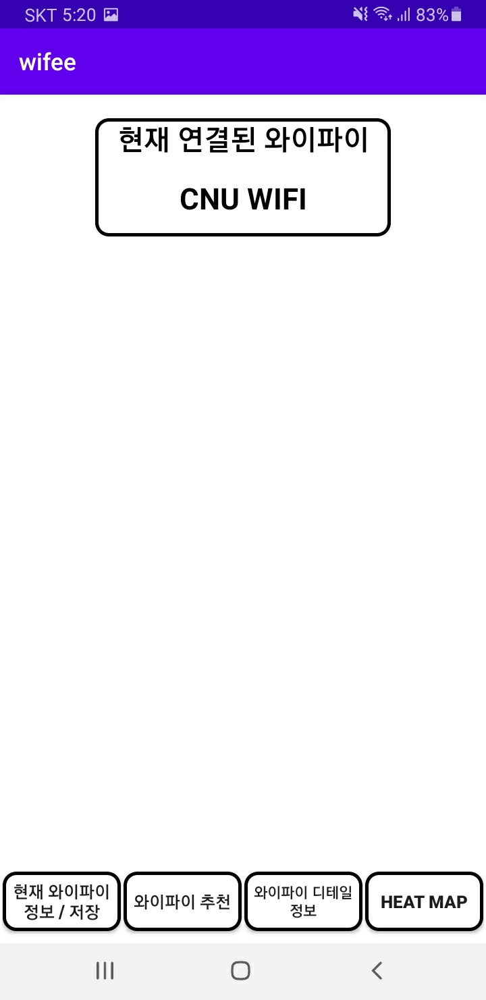
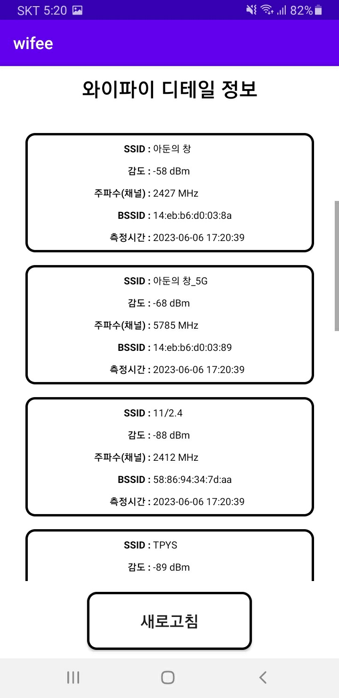

<h1>WiA(Wifi Analysis)</h1>
 
<h2>개요</h2>

WiA는 현재 접속중인 와이파이의 연결을 AR로 시각화 시켜주는 AOS용 어플리케이션 입니다.

<h2>주요 기능</h2>

<ul>
  <li>현재 접속중인 와이파이 AR로 시각화</li>
  <li>주변 와이파이 검색 및 자세한 정보 제공</li>
  <li>현재 접속중인 와이파이 AR로 HEAT MAP 구현</li>
  <li>카카오 맵 API를 이용한 공공와이파이 정보 공유</li>
</ul>

<h2>예시 이미지</h2>

  
  
  
  
  

<h2>요구사항</h2>

안드로이드 7.0(API 24이상): AR Core구동 필요조건

